<p align="center">
  
</p>

# Snapchat Export Analyzer

A privacy-first web dashboard for reviewing communication exports that an account owner willingly provides. The app runs mostly in the browser so uploads stay local, while still supporting deeper analytics, evidence-backed summaries, and optional AI-assisted review.

<p align="center">
  <code>React</code> <code>Vite</code> <code>Local Parsing</code> <code>Evidence</code> <code>AI Review</code>
</p>

## Cheap stack

- GitHub for source control, issues, and Actions
- React + Vite for the dashboard UI
- Firebase Hosting for a Google-hosted static deploy
- Optional Cloud Run service later for PDF generation, auth, or secured report sharing

## Why this architecture

- Lowest risk: export files can stay on the user device
- Lowest cost: static hosting is usually enough for the first release
- Easy to grow: add Cloud Run only when a browser-only workflow becomes limiting

## Current capabilities

1. Show a startup selector for `Snapchat` or `Facebook` before any workspace loads.
2. Parse supported JSON, CSV, HTML, and TXT files locally with upload/file provenance.
3. Normalize useful rows into account, chat, contact, location, search, login, post/reaction/group/event, and media-style events.
4. Build lightweight thread/contact indexes on load, then run deeper AI organization only on a selected thread.
5. Support multiple uploads in one workspace to enable cross-upload comparison.
6. Browse full contact threads in a chat-first layout with manual local grouping labels.
7. Search custom keywords or phrases across all parsed text.
8. Import either zip exports or extracted export folders, with folder mode skipping media files.
9. Load a Python-preprocessed cache JSON for very large exports.
10. Export normalized events, contacts, keyword matches, and a structured workspace report.
11. Run optional browser-side AI review using Gemini or OpenAI with a user-provided API key.

## Dashboard sections

- Executive overview
- Upload and account overview
- Timeline explorer
- Hourly and weekday activity views
- Communication patterns
- Entity extraction
- Repeated phrase and tone classification
- Deterministic findings and notable periods
- Evidence snippets
- Optional AI review

## Platform support

- Snapchat: saved chats, search, login/device, location, memories, and related export files.
- Facebook: profile information, Messenger inbox, friends/followers, search history, security/login, comments, reactions, posts, groups, events, location/check-ins, and media metadata.

## Snapchat export coverage

Support these import paths first:

- Full `My Data` export
- Memories-only export

Keep these fields first:

- timestamps
- usernames and display names
- chat and snap metadata
- saved chat history
- location points
- search history
- login history and device changes
- memories metadata and optional media references

Discard or ignore these by default:

- Bitmoji data
- support history
- shop and purchase history
- cosmetic profile metadata
- duplicate previews and wrapper files

## Local development

```bash
npm install
npm run dev
```

## Production build

```bash
npm run build
```

## Faster local preprocessing for huge exports

For very large extracted exports, preprocess the folder once with Python and then load the generated JSON cache in the dashboard with `Load Python cache`.

```bash
python scripts/preprocess_snapchat_export.py "C:\path\to\extracted\snapchat-export"
```

Default output:

```text
%USERPROFILE%\Desktop\snapchat_export_cache.json
```

That path avoids reparsing the raw export in the browser on every refresh.

## Offline Facebook chat viewer

If you want a fast local-only Facebook chat viewer, run the exporter script on an extracted Facebook data folder. It writes a static HTML file to your Desktop with a thread list, readable message cards, and TXT download buttons.

```bash
python scripts/export_facebook_chat_viewer.py "C:\path\to\extracted\facebook-export"
```

Default output:

```text
%USERPROFILE%\Desktop\facebook_chat_viewer.html
%USERPROFILE%\Desktop\facebook_chat_viewer.json
```

The page opens offline in your browser and keeps the chat text separated by sender, timestamp, and message body.

## Free hosting with GitHub Pages

This project is set up for free static hosting on GitHub Pages using GitHub Actions.

1. Create a GitHub repo and push this project to the `main` branch.
2. In GitHub, open `Settings` -> `Pages`.
3. Under `Build and deployment`, choose `GitHub Actions`.
4. Push to `main` and wait for the `Deploy to GitHub Pages` workflow to finish.
5. Your dashboard will be published at `https://<your-github-username>.github.io/<repo-name>/`.

The workflow file is already included at [.github/workflows/deploy-pages.yml](/C:/Users/Anon/Documents/Snapchat%20Spy/.github/workflows/deploy-pages.yml).

## Firebase Hosting deploy

1. Create a Firebase project in Google Cloud.
2. Install the CLI with `npm install -g firebase-tools`.
3. Run `firebase login`.
4. Run `firebase init hosting` and set `dist` as the public directory.
5. Build the app with `npm run build`.
6. Deploy with `firebase deploy`.

The repo already includes a starter [firebase.json](/C:/Users/Anon/Documents/Snapchat%20Spy/firebase.json) for SPA rewrites.

## Codex spec

The refined prompt used for the Facebook viewer extension is in [docs/facebook-viewer-codex-prompt.md](/C:/Users/Anon/Documents/Snapchat%20Spy/docs/facebook-viewer-codex-prompt.md).

## Next build steps

- Add downloadable PDF reports
- Add richer filtering and saved workspaces
- Add stronger Snapchat-specific parsers for known export file structures
- Move optional AI requests behind a backend if you need stronger key isolation
